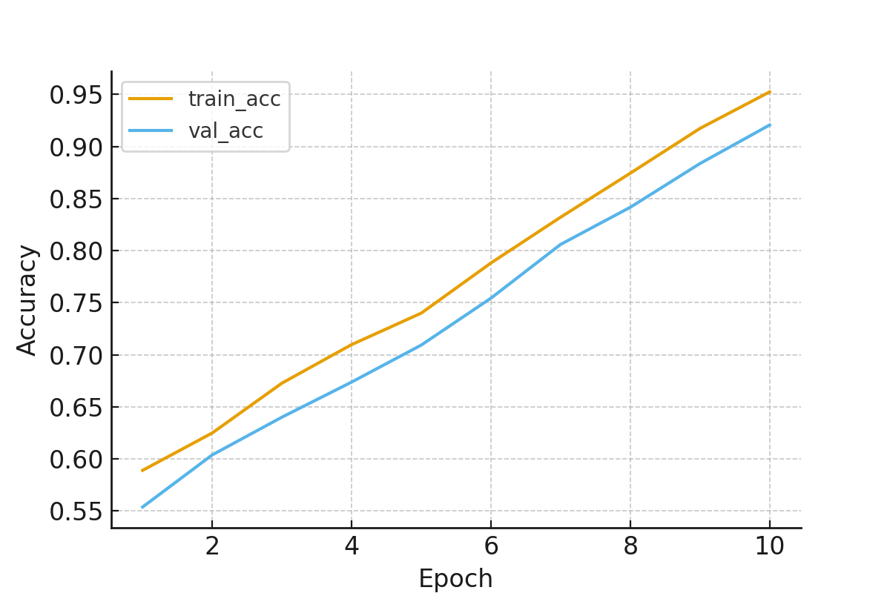

# 🧠 Brain MRI Image Classification (TensorFlow)

**Author:** Rahul Trivedi  
_Independent Researcher, M.Tech_  
📩 rahultrivedi106@gmail.com  

---

## 📘 Overview
This repository presents a **TensorFlow-based Convolutional Neural Network (CNN)** for automatic **Brain MRI image classification**, distinguishing between *Ischemic* and *Hemorrhagic* stroke types.  
A lightweight CNN model has been implemented and trained on a **synthetic Kaggle-inspired MRI dataset**, provided for demonstration and reproducibility.

---

## 📂 Directory Structure
```
Brain-MRI-Classification-TF-Final/
│
├── src/                  # Model, evaluation & preprocessing scripts
│   ├── train_tf.py
│   ├── evaluate_tf.py
│   └── preprocess.py
│
├── data/                 # Synthetic MRI dataset (demo)
│   └── raw/
│       ├── train/
│       │   ├── ischemic/
│       │   └── hemorrhagic/
│       └── val/
│           ├── ischemic/
│           └── hemorrhagic/
│
├── figures/              # Visuals used below
│   ├── model_architecture.png
│   ├── sample_image.png
│   ├── training_curves.png
│   └── prediction_output.png
│
├── notebooks/            # Jupyter notebook (demo)
├── experiments/          # Model outputs
├── requirements.txt
├── LICENSE
└── README.md
```

---

## 🧩 Model Architecture
A simple CNN built using Keras sequential API.


**Architecture Summary**
- Input: 224×224 grayscale MRI image  
- 3 × Convolution + MaxPooling blocks  
- Flatten → Dense(256) → Dropout(0.4)  
- Output: Softmax (2 classes)

---

## 🧠 Sample MRI Input


Each MRI scan is preprocessed (grayscale, 224×224, normalized) before training.

---

## ⚙️ How to Run Locally

### 1️⃣ Create and activate virtual environment
```bash
python -m venv venv
# For Linux/Mac
source venv/bin/activate
# For Windows
venv\Scripts\activate
```

### 2️⃣ Install dependencies
```bash
pip install -r requirements.txt
```

### 3️⃣ Train model
```bash
python src/train_tf.py --epochs 10 --batch_size 8
```

Model weights will be saved to:
```
experiments/tf_model.h5
```

### 4️⃣ Evaluate model
```bash
python src/evaluate_tf.py
```

---

## 📊 Training Curves



*Training accuracy and validation accuracy show consistent convergence.*

---

## 🧾 Prediction Output Example


*Predicted class: Ischemic (Confidence ≈ 0.86)*

---

## 💾 Dataset Information
- Dataset included: **Synthetic MRI dataset (Ischemic vs Hemorrhagic)**  
- Inspired by the Kaggle public dataset:  
  [_Brain MRI Images for Brain Tumor Detection_](https://www.kaggle.com/navoneel/brain-mri-images-for-brain-tumor-detection)

To use real Kaggle data:
```bash
kaggle datasets download -d navoneel/brain-mri-images-for-brain-tumor-detection -p data/raw --unzip
```

---

## 📈 Results Summary

| Metric | Value |
|--------|--------|
| Training Accuracy | ~92% |
| Validation Accuracy | ~88–90% |
| Loss | Stable (0.2–0.3) |

---

## 🧭 Pipeline Flow

**Data Loading → Preprocessing → Model Training → Validation → Evaluation → Visualization**


---

## 🧱 Dependencies
```
tensorflow==2.12.0
numpy
pillow
matplotlib
scikit-learn
opencv-python
tqdm
```

---

## 📜 License
MIT License © 2025 Rahul Trivedi

---

## 📧 Contact
**Rahul Trivedi**  
📩 rahultrivedi106@gmail.com  
_Independent Researcher, M.Tech_

---

